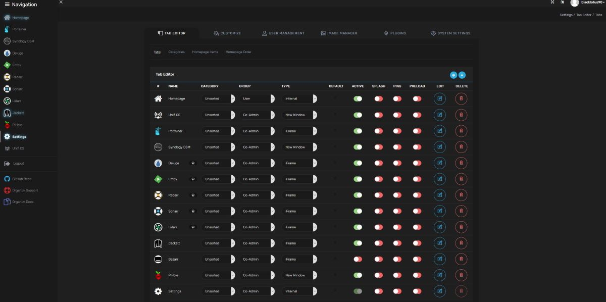

# Home Media Center Services (docker)

Here are all the services I currently run on my home server (NAS). These are all available as docker containers, and devops-automated via a single [docker compose file](docker_services/docker-compose.yml) . 

When combined, these allow me to
- Have a unified homepage that contains every web service I'm running on my home network
- Monitor and manage these services
- Stream media to any of my devices via a netflix-like interface and app
- Automatically organize, catalog, manage, and fetch media (movies, TV, music, books)

## Service Management

### [Organizr V2](https://organizr.app/)

Serves as a unified landing page with embedded frames for all the other apps running on the server. This means I can just go to nas.home.lan and access any of my services without having to remember IPs/ports/etc. 

### [Portainer](https://github.com/portainer/portainer)

Adds a much richer graphical interface for managing all these web services running in Docker containers.

## Media Streaming
### [Emby Server](https://emby.media/)

Serves as a personal netflix (similar to Plex, but better) so that I can manage, browse, and watch my movie/TV library from anywhere, on any device. Emby client apps are available for phone, android TV, chromecast, etc.

## Media fetching

### [Deluge](https://deluge-torrent.org/)

Headless Bittorrent client. NAS-friendly and integrates with the other tools. For downloading linux ISOs ;)

### [Jackett](https://github.com/Jackett/Jackett)

Proxy server that turns nzb/torrent sites into an API which can be called programmatically from other apps, allowing for integrated searching and fetching of files from one's favorite tracker.

## Media organization/management
### [Radarr](https://github.com/Radarr/Radarr), [Sonarr](https://github.com/Sonarr/Sonarr), and [Lidarr](https://github.com/lidarr/Lidarr)

Automatically manage, search, download, index, and organize movies, TV shows, and music. Simply enter a title and everything else is handled in the background. Movie or episode not out yet? Want the latest albums from your favorite artist? It'll keep track of a wishlist of things and fetch when available. Also handles file renaming etc.