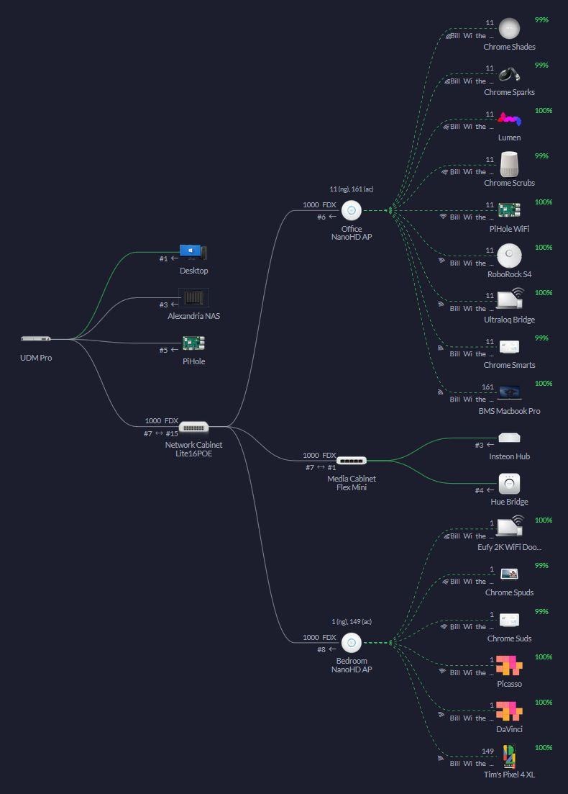
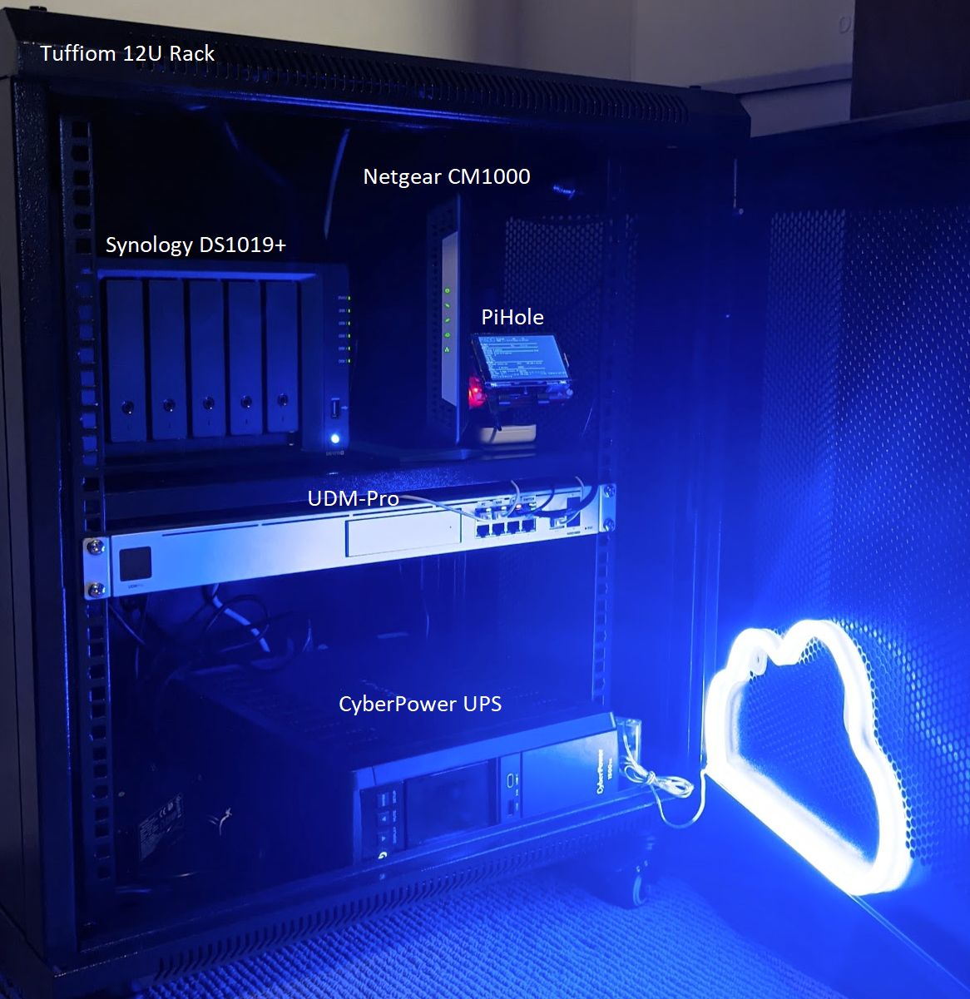
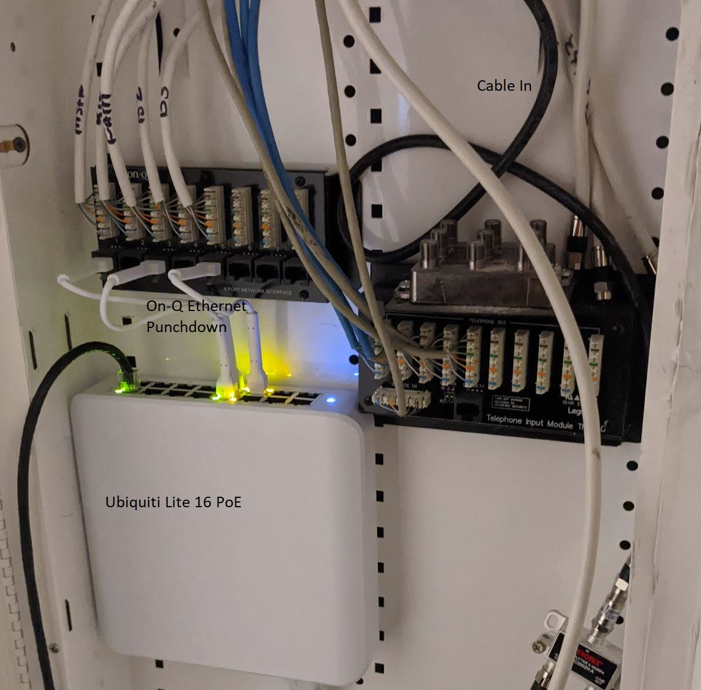
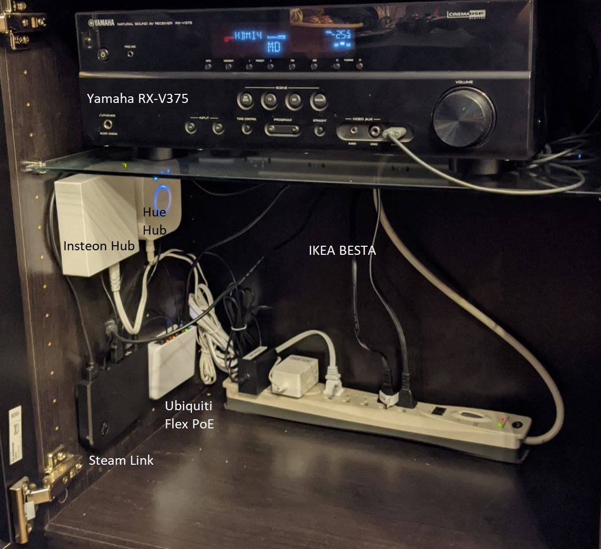

# My connected home setup
Documentation for IoT/smarthome devices and network setup for others trying to accomplish something similar, and so I don't forget what I did.

## Home Media Server

I have a Synology DS1019+ NAS with 32TB of redundant storage (4 8TB WD Reds). It's set up in SHR-1 RAID, which means that it can recover even if 1 drive fails, and can be expanded flexibly. 

This NAS also serves as a home server, running a bunch of web services I can access while on my network.
When combined, these allow me to

- Have a **unified homepage** that contains every web service I'm running on my home network
- **Monitor and manage** these services themselves
- **Stream media** to any of my devices via a netflix-like interface and app
- **Automatically organize, catalog, manage, and fetch** media (movies, TV, music, books)

**[Here are the services I run on my NAS](NAS/docker_services.md)**

**[Here's how I set up my NAS](NAS/nas_setup_notes.md)**

## Networking

I have a Ubiquiti network setup with **[50+ smarthome/IoT devices](Networking/smarthome_inventory.md).** 

A rough map of the network is below:

### Networking Devices

| Device                                 | Function                                    |
| -------------------------------------- | ------------------------------------------- |
| Netgear CM1000                         | Cable Modem                                 |
| Ubiquiti Dream Machine Pro             | Gateway, Router, Firewall, Controller, DHCP |
| Ubiquiti UniFi Switch Lite 16 PoE      | PoE-out switch (network cabinet)            |
| Ubiquiti UniFi Switch Flex Mini        | PoE switch (media center)                   |
| Ubiquiti UniFi NanoHD AP (2)           | WiFi Access Points                          |
| Raspberry Pi B+                        | Pihole DNS server                           |
| Synology DS1019+ (w/ 4 WD RED 8TB HDD) | Server, NAS                                 |
| Cyberpower CP1500PFCLCD Sinewave       | UPS                                         |
| TUFFIOM 12U Network Enclosure          | Equipment Rack                              |

### Physical Setup

The backbone of the physical network is split between 3 main locations:

#### Central Networking Rack

#### Networking Cabinet

#### Media Center (deprecated after upgrading to Nvidia Shield)

### Network Setup

The network is divided into 3 VLANs, served over wired or via 2 Wifi SSIDs. Firewall rules control access to/from/between VLANs. There is much more detail at the link below:

**[Here are some notes and settings about how I set up my network](Networking/network_setup_notes.md)** (TODO)
